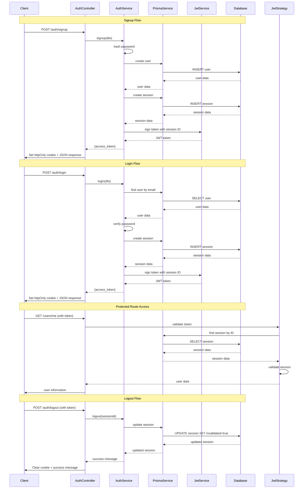

# Authentication Flow

```mermaid
sequenceDiagram
    participant Client
    participant AuthController
    participant AuthService
    participant PrismaService
    participant JwtService
    participant Database

    Note over Client,Database: Signup Flow
    
    Client->>AuthController: POST /auth/signup
    AuthController->>AuthService: signup(dto)
    AuthService->>AuthService: hash password
    AuthService->>PrismaService: create user
    PrismaService->>Database: INSERT user
    Database-->>PrismaService: user data
    PrismaService-->>AuthService: user data
    AuthService->>PrismaService: create session
    PrismaService->>Database: INSERT session
    Database-->>PrismaService: session data
    PrismaService-->>AuthService: session data
    AuthService->>JwtService: sign token with session ID
    JwtService-->>AuthService: JWT token
    AuthService-->>AuthController: {access_token}
    AuthController->>Client: Set httpOnly cookie + JSON response
    
    Note over Client,Database: Login Flow
    
    Client->>AuthController: POST /auth/login
    AuthController->>AuthService: login(dto)
    AuthService->>PrismaService: find user by email
    PrismaService->>Database: SELECT user
    Database-->>PrismaService: user data
    PrismaService-->>AuthService: user data
    AuthService->>AuthService: verify password
    AuthService->>PrismaService: create session
    PrismaService->>Database: INSERT session
    Database-->>PrismaService: session data
    PrismaService-->>AuthService: session data
    AuthService->>JwtService: sign token with session ID
    JwtService-->>AuthService: JWT token
    AuthService-->>AuthController: {access_token}
    AuthController->>Client: Set httpOnly cookie + JSON response
    
    Note over Client,Database: Protected Route Access
    
    Client->>AuthController: GET /users/me (with token)
    AuthController->>JwtStrategy: validate token
    JwtStrategy->>PrismaService: find session by ID
    PrismaService->>Database: SELECT session
    Database-->>PrismaService: session data
    PrismaService-->>JwtStrategy: session data
    JwtStrategy->>JwtStrategy: validate session
    JwtStrategy-->>AuthController: user data
    AuthController->>Client: user information
    
    Note over Client,Database: Logout Flow
    
    Client->>AuthController: POST /auth/logout (with token)
    AuthController->>AuthService: logout(sessionId)
    AuthService->>PrismaService: update session
    PrismaService->>Database: UPDATE session SET invalidated=true
    Database-->>PrismaService: updated session
    PrismaService-->>AuthService: updated session
    AuthService-->>AuthController: success message
    AuthController->>Client: Clear cookie + success message
```